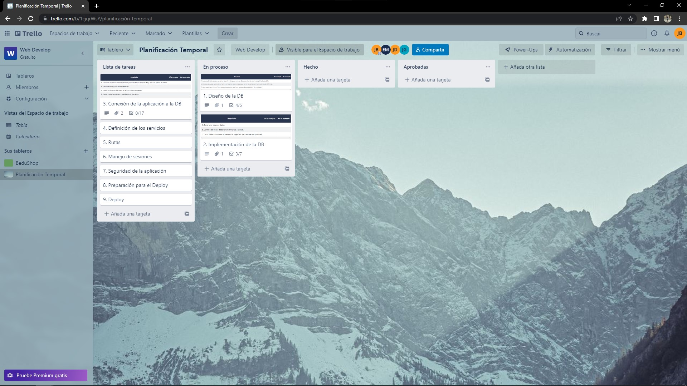
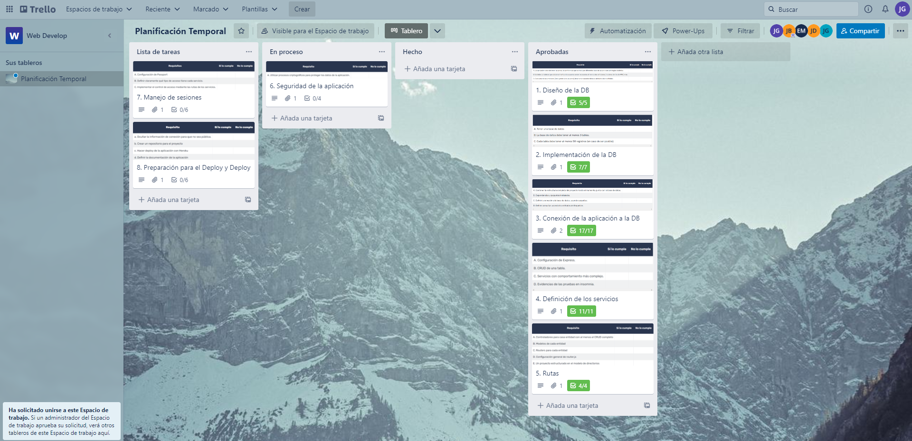
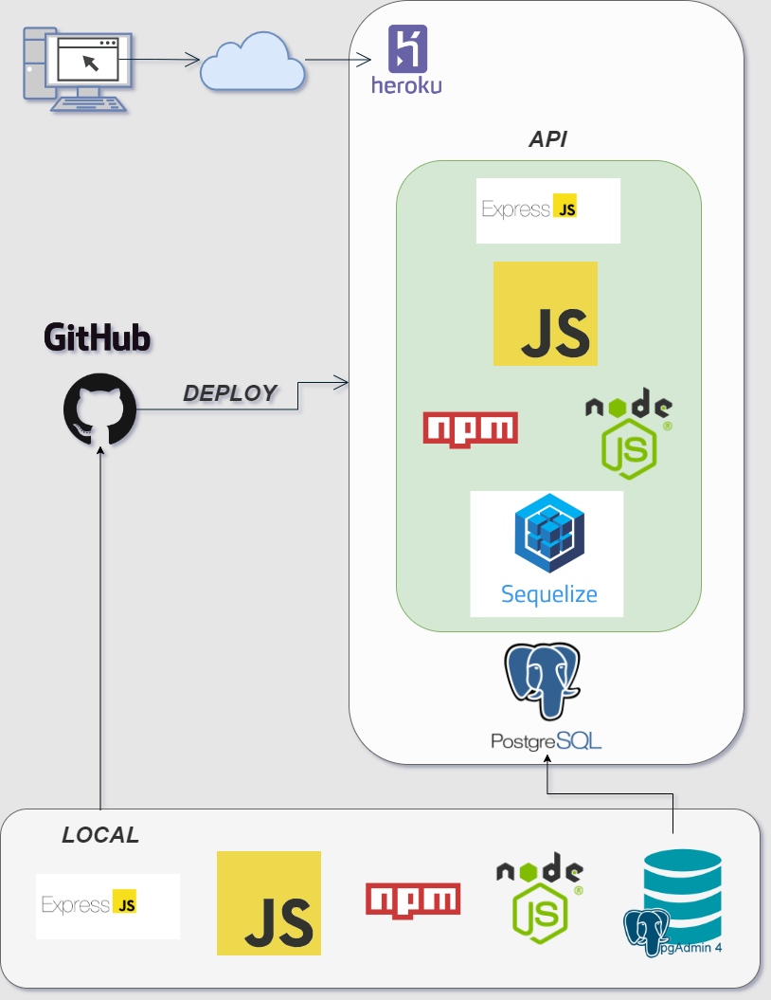

# Escuela-de-artes

>Proyecto Final del Modulo 2: Fundamentos de Backend Santander 2022 elaborado por el equipo 14.

## ** Repositorio: Postwork-1 - Modelado y Arquitectura del Backend **

### 📋 Reporte - entregables y evidencia

#### 1. Objetivos del proyecto
se discutió en equipo para decidir el proyecto a desarollar y se crearon los objetivos del proyecto
- [`Objetivo`](rd-obj/1.Objetivos_del_Proyecto.md)

#### 2. Planificación temporal
Se crearon los planes en equipo a través de trello
 

Conforme avanza el proyecto, se van actualizando las actividades en trello
 

#### 3. Diagramas de herramientas
Se planificó en equipo cómo se va a desarrollar el proyecto y qué herramientas y recursos a usar
 

Se realizó la investigación de las herramientas a utilizar:
+ [Investigación de Herramientas:](pdf/3.1_Invenstigación_de_Herramientas.pdf)

#### 4. Histrias de usuario
Se crearon las historias de usuario en base a los objetivos del proyecto, se discutieron en equipo
+ [Historias de Usuario](pdf/4_Historias_de_usuario.pdf)

#### 5. Entidades y atributos
Se definió las entidades y atributos del proyecto, se discutió en eqipo
+ [Entidades y Atributos](pdf/5_Entidades_y_atributos.pdf)

-------
[`Página principal`](../../README.md) | [`Siguiente: Sesión - pw2`](../pw2/README.md)
