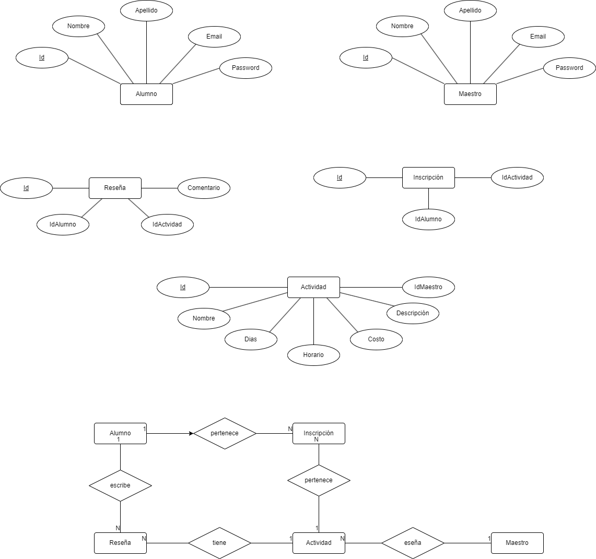
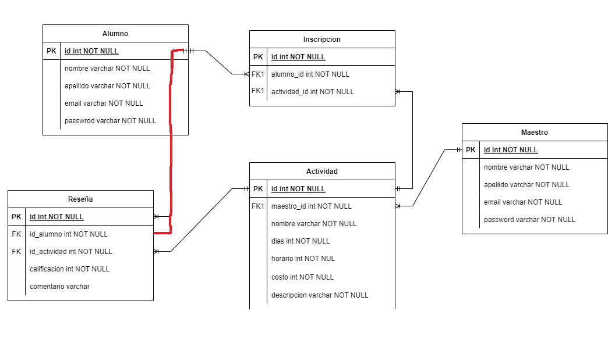
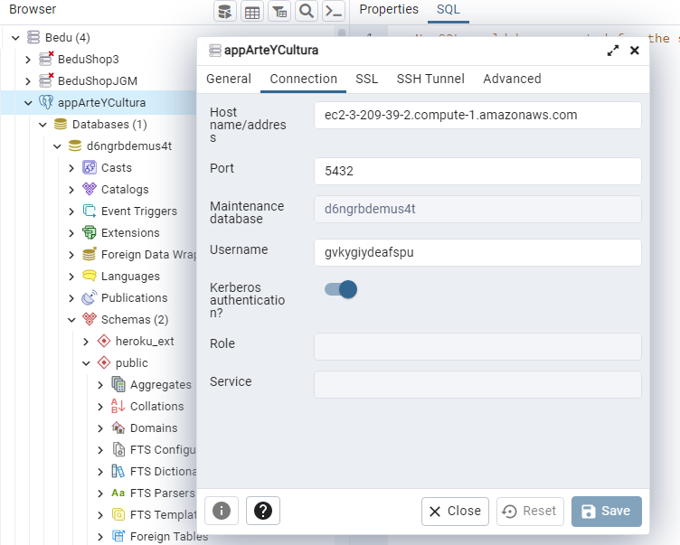
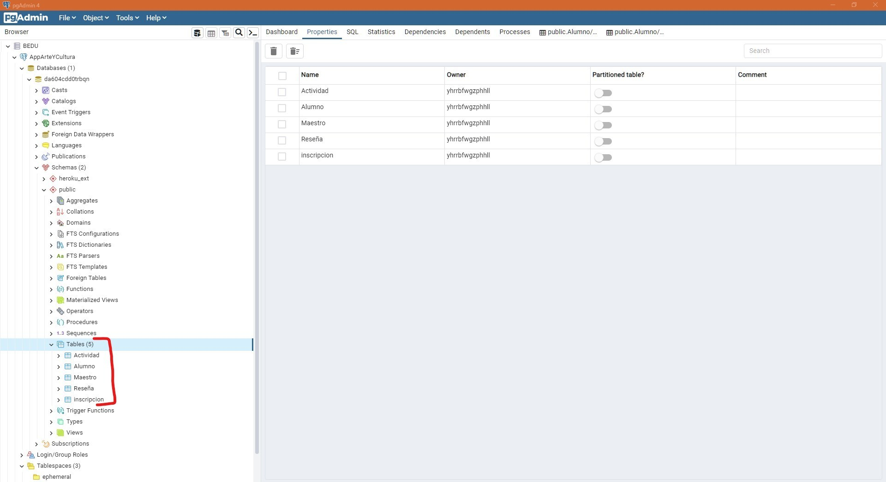
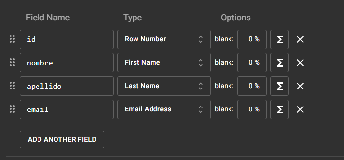

# Escuela-de-artes

>Proyecto Final del Modulo 2: Fundamentos de Backend Santander 2022 elaborado por el equipo 14.

## ** Repositorio: Postwork-4 - Introducción a bases de datos **

### 📋 Reporte - entregables y evidencia

#### 1. Diagramas entidad relación
Se crearon los diagramas de entidad relacion y modelo relacional

**Diagrama entidad relación**
 

**Modelo relacional**
 

#### 2. Proyecto Heroku
Se creó la base de datos en Heroku, se utilizó el Ad-Ons de Postgres
+ [Base Datos:](pdf/2_CredencialesDBHeroku.pdf)

 

#### 4. Conexión con PGAdmin4
Se configuró poder conectar con PGAdmin a la base de datos creada en Heroku
 

#### 5. Esquema base de datos
Se tradujo el modelo original escrito en el diagrama entidad-relacion a tablas en la base de datos
 

#### 6. Poblado base de datos con Mokaroo
Se utilizó mockaroo para poblar la base de datos 
 

#### 7. Poblado base de datos con Mokaroo
Se realizon consultas a las tablas en postgres, tambien se realizaron actualizaciones  eoliminación de registros
+ [Postgres:](pdf/7_ConsultasPostgresSQL.pdf)

 

-------
[`Página principal`](../../README.md) | [`Anterior: Sesión - pw1`](../pw1/README.md) | [`Siguiente: Sesión - pw3`](../pw3/README.md)