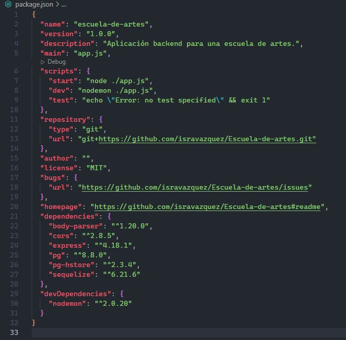
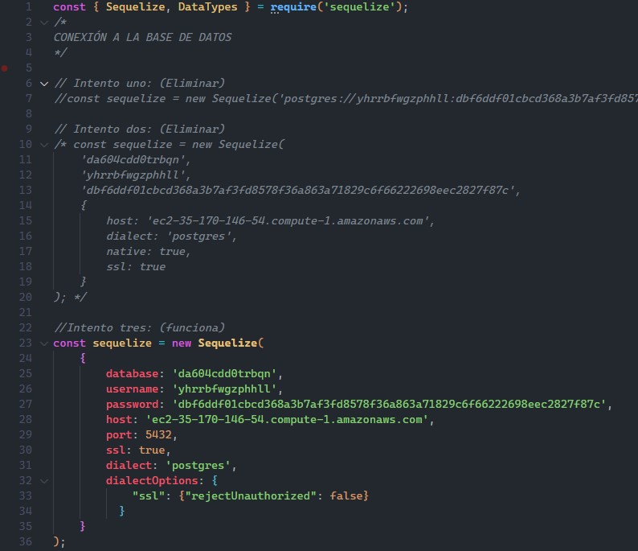

# Escuela-de-artes

>Proyecto Final del Modulo 3: Fundamentos de Backend Santander 2022 elaborado por el equipo 14.

## ** Repositorio: Postwork-3 - Sequelize **

### 📋 Reporte - entregables y evidencia

#### 1. esqueleto del proyecto
se creó el equeleto del proyecto 
 

#### 2. dependencias
Se instalaron las dependencas a utilizar en el proyecto
 

#### 3. Credenciales
Se configuraron las credenciales de Heroku para la base de datos
 

-------
[`Página principal`](../../README.md) | [`Anterior: Sesión - pw2`](../pw2/README.md) | [`Siguiente: Sesión pw4`](../pw4/README.md)
