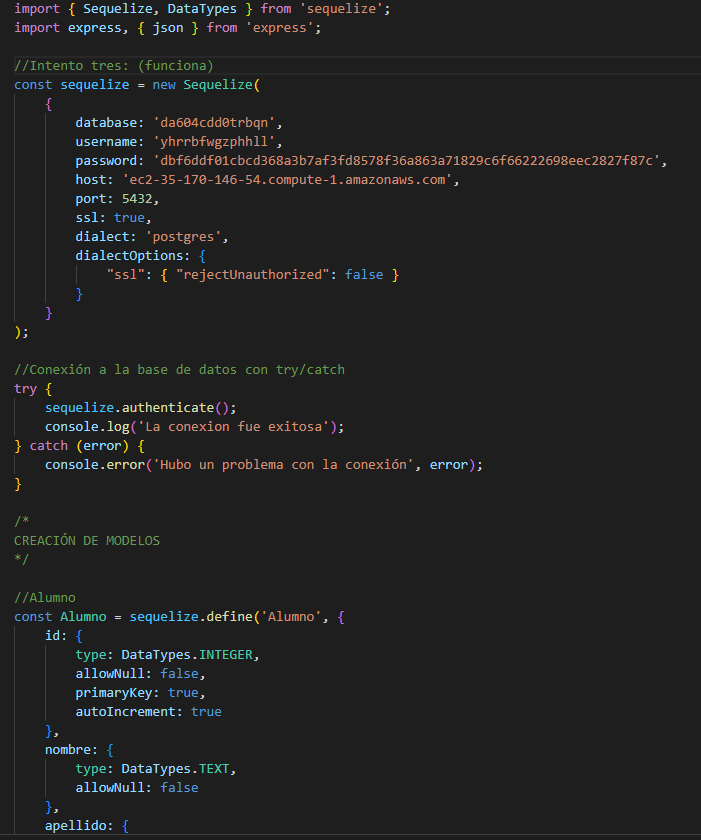
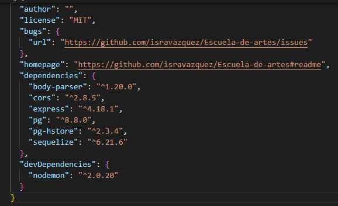
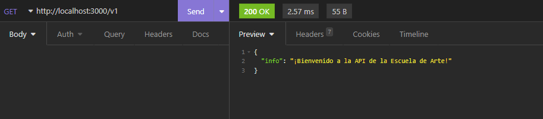
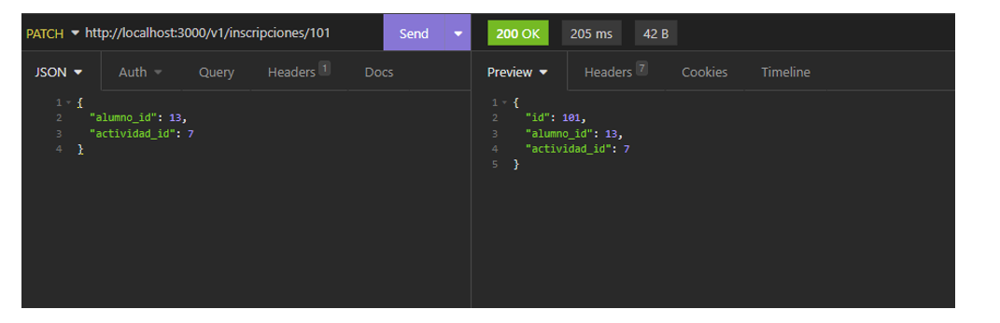
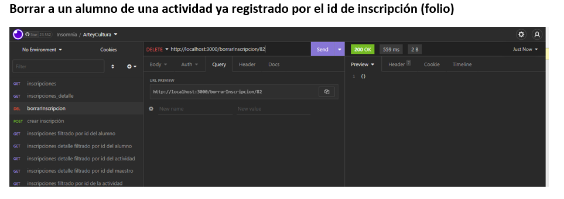
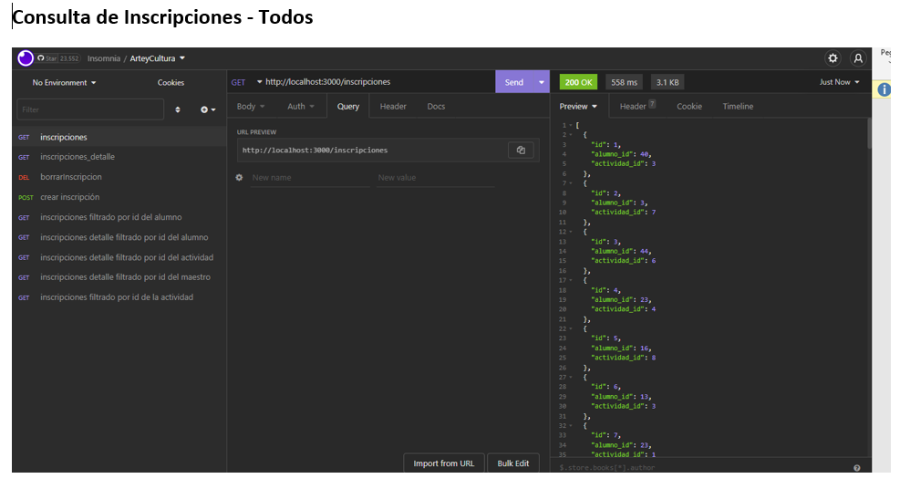
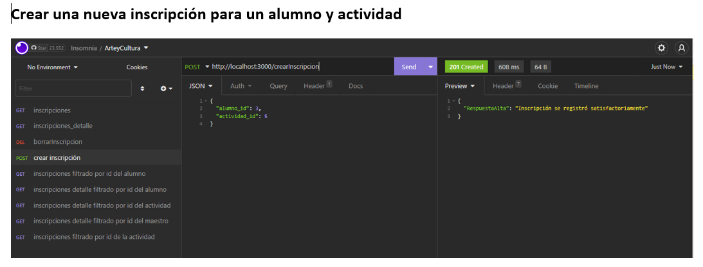
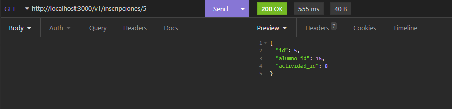
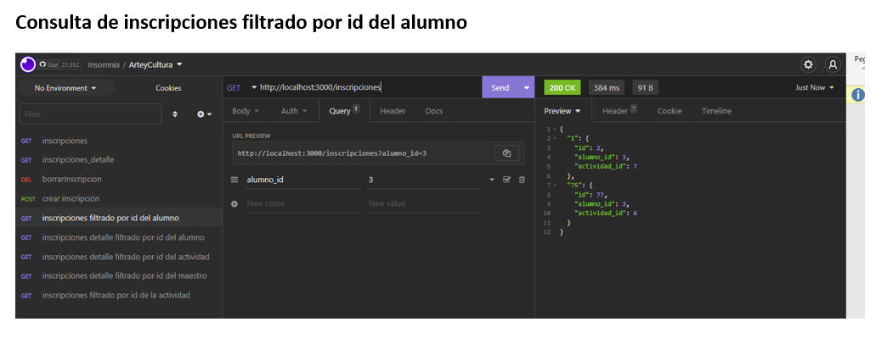
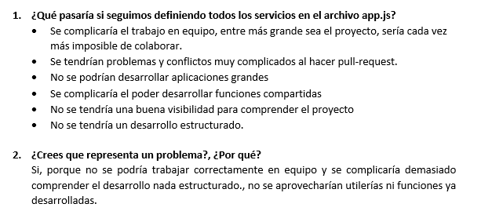

# Escuela-de-artes

>Proyecto Final del Modulo 2: Fundamentos de Backend Santander 2022 elaborado por el equipo 14.
Repo: Postwork-4 - Express.js

## ** Repositorio: Postwork-4 - Express **

### 📋 Reporte - entregables y evidencia

#### 1. Configuración express
Se configuró express en el proyecto

 
 

#### 2. Petición GET URL
Se realizó una prueba a la URL para ver que si funcione
 

#### 3. Creación del CRUD y Pruebas
Se realizaron pruebas a una entidad definiendo un CRUD completo 
 
 
 
 

#### 4. Creación y pruebas consulta por ID
Se definió y realizaron pruebas a una consulta por ID 
 
 

#### 5. Pregunta
Qué pasaría si seguimos definiendo todos los servicios en el archivo app.js?
Crees que representa un problema?, Porque?
 

-------
[`Página principal`](../../README.md) | [`Anterior: Sesión - pw3`](../pw3/README.md) | [`Siguiente: Sesión -pw4`](../pw5/README.md)
