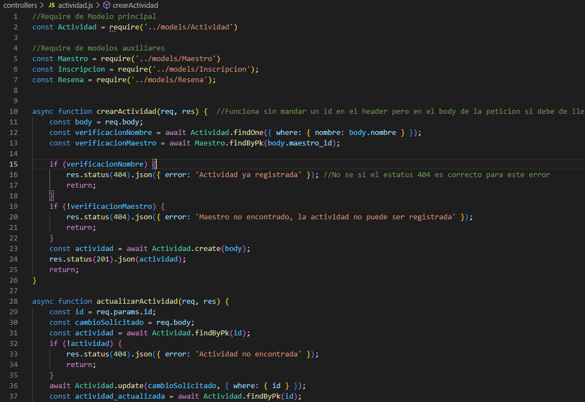
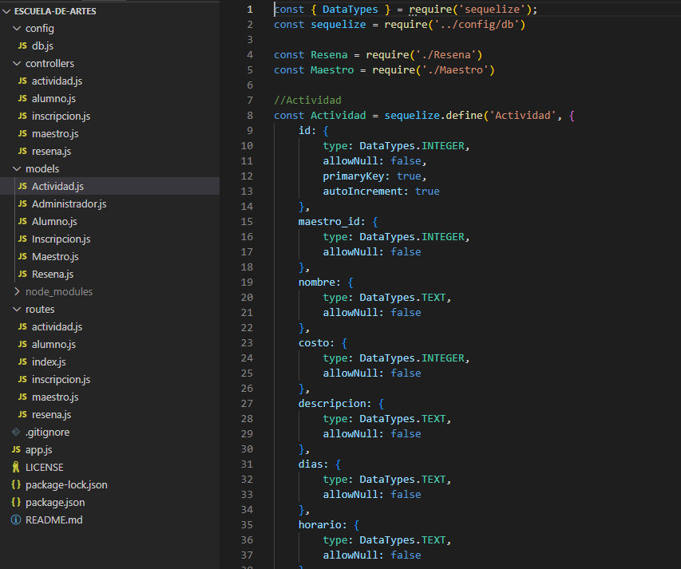
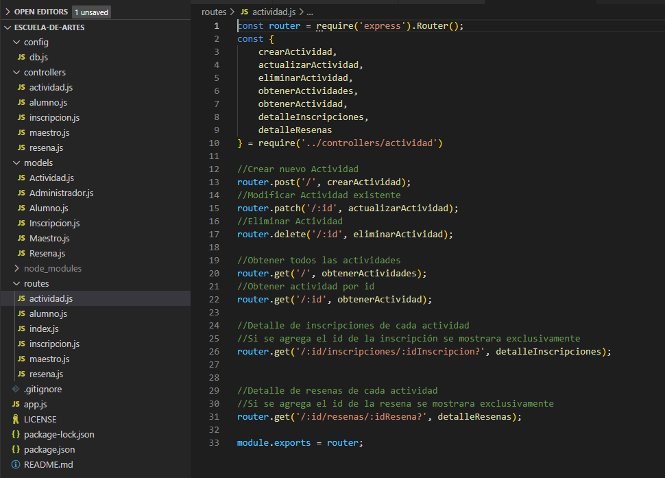
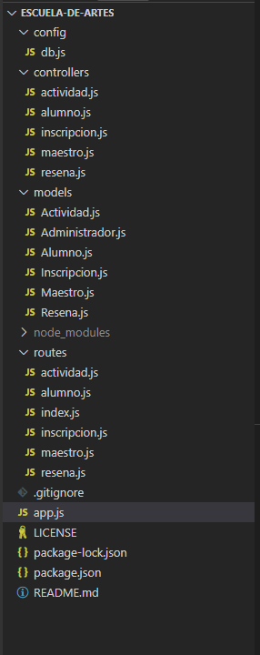

# Escuela-de-artes

>Proyecto Final del Modulo 2: Fundamentos de Backend Santander 2022 elaborado por el equipo 14.
## ** Repositorio: Postwork-5 - Routes **

### 📋 Reporte - entregables y evidencia

Se reestructura el código del proyecto en base a los directorios defindos para controladores y modelos y se crean los routes para cada entidad

### **Ejemplos:**

#### Ejemplo configuración controlador

#### Ejemplo configuación Modelo

#### ejemplo configuración Routes

+ [__Link configuración Routes__](pdf/4D_ConfiguracionRouter.pdf)

#### Ejemplo Estructura de Roues

 
-------
[`Página principal`](../../README.md) | [`Anterior: Sesión - pw4`](../pw4/README.md) | [`Siguiente: Sesión - pw6`](../pw6/README.md)
