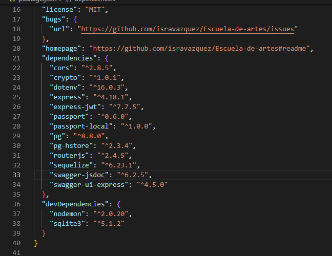
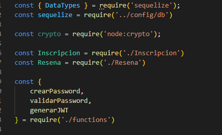
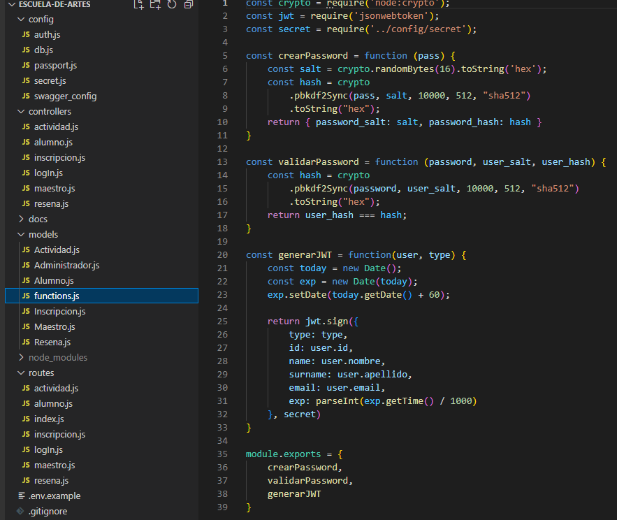
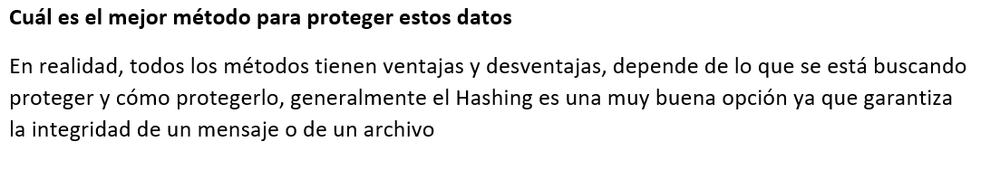

# Escuela-de-artes

>Proyecto Final del Modulo 2: Fundamentos de Backend Santander 2022 elaborado por el equipo 14.

## ** Repositorio: Postwork-6 - Seguridad **

### 📋 Reporte - entregables y evidencia

Se instala el paquete crypto y se protegen datos sensibles

### **Ejemplos:**

#### 1.- Identificación datos sensibles

Se identifican datos sensibles en tablas del proyecto, siendo el **Password** a proteger
+ [__Link datos sensibles__](pdf/1.DatosSensibles.pdf)

#### 2.- Ejemplo paquete crypto

#### 3.- Pregunta: cual es el mejor método para proteger los datos?

-------
[`Página principal`](../../README.md) | [`Anterior: Sesión - pw5`](../pw5/README.md) | [`Siguiente: Sesión - pw7`](../pw7/README.md)
