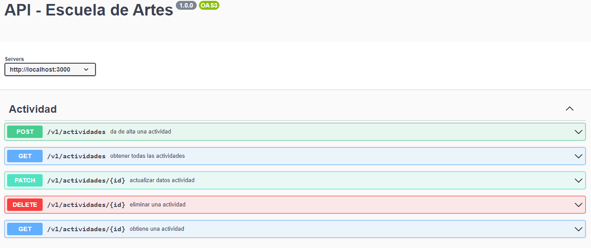
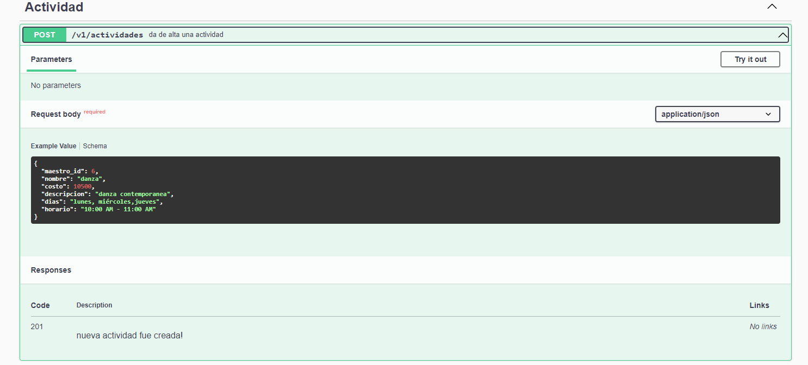
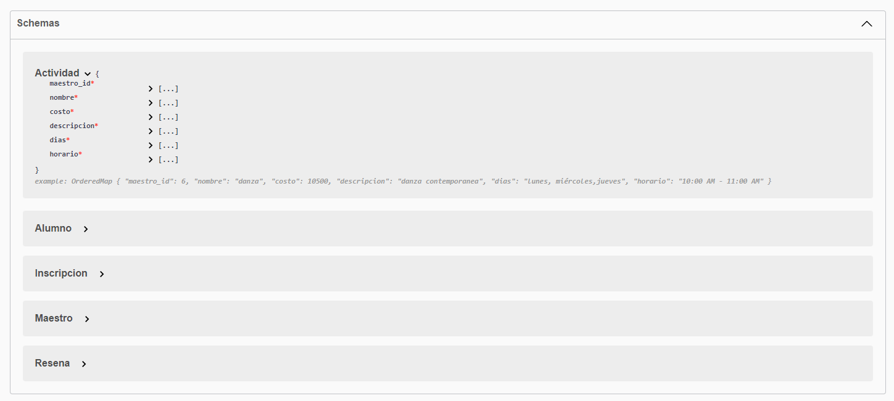
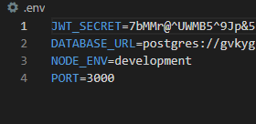
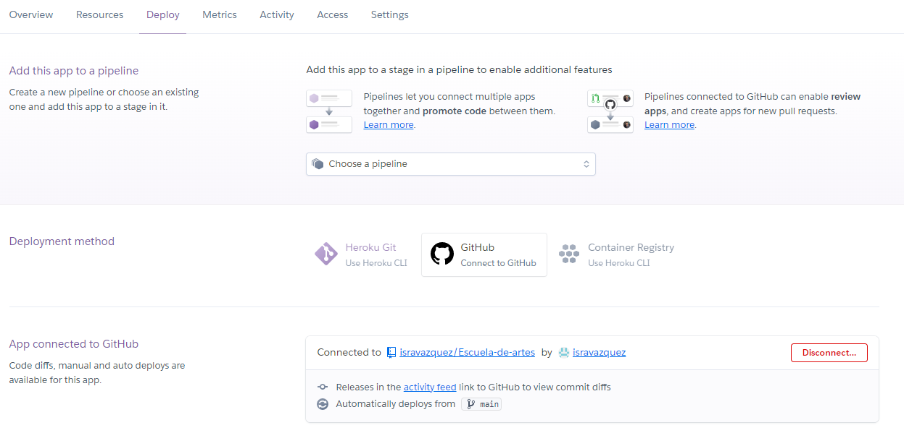
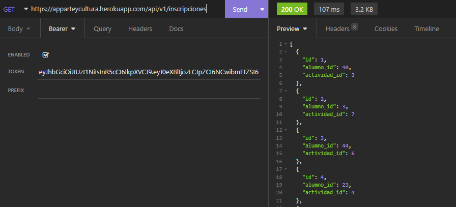
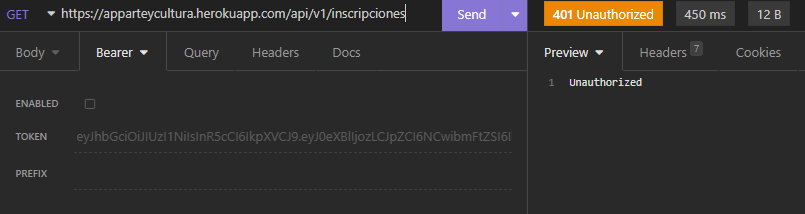

# Escuela-de-artes

>Proyecto Final del Modulo 2: Fundamentos de Backend Santander 2022 elaborado por el equipo 14.

## ** Repositorio: Postwork-8 - Deploy y Documentación **

### 📋 Reporte - entregables y evidencia

Se crea la documentación en swagger y se realiza el deploy en heroku, se valida funcionen bien las apis de acuerdo a sus accesos asignados con y sin token

#### 1.- Documentación en Swagger

###### apis

##### Esquema en swagger

#### 2.- Configuración variables de entorno

#### 3.- Deploy en heroku

#### 4.- Deploy-Pruebas de acceso en la api

##### Consulta con token

##### Consulta sin token

-------
[`Página principal`](../../README.md) | [`Anterior - pw7`](../pw7/README.md)
