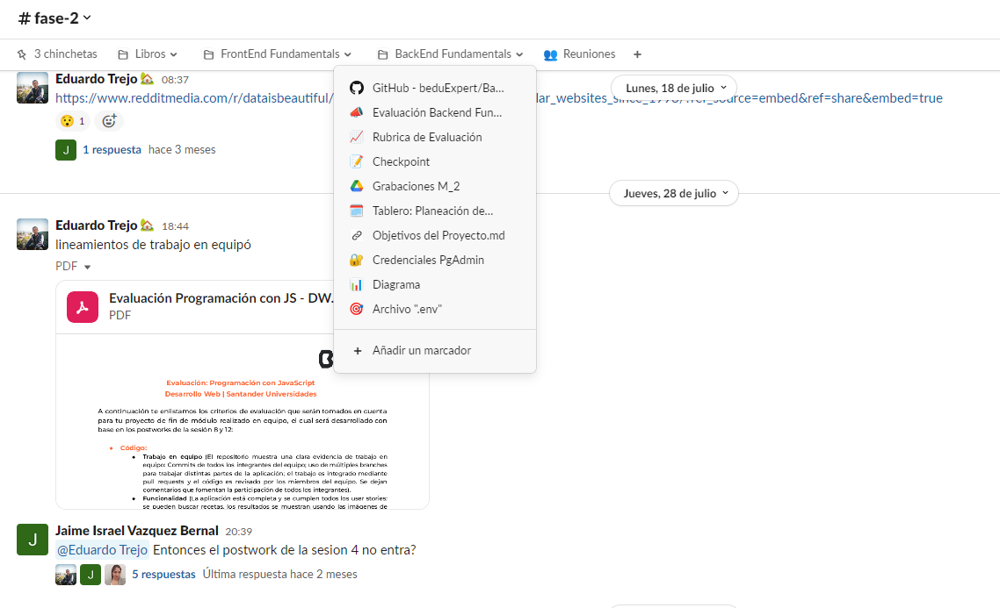
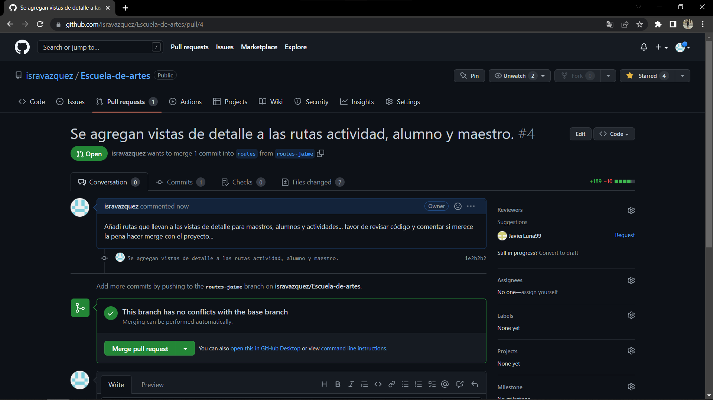

# Escuela-de-artes

>Proyecto Final del Modulo 2: Fundamentos de Backend Santander 2022 elaborado por el equipo 14.

## ** Repositorio: Trabajo en equipo **

### 📋 Reporte - entregables y evidencia

#### 1. Organización
Nos orgaizamos para trabajar en equipo realizando reunioes los lunes y jueves a traves de videollamadas teniendo comunicación constante a través de slack y trello para el control y asignacón de tareas.

+ [__link__ evidencias trabajo equipo](pdf/2.evidencias.pdf)

 

#### 2. Github 
Se revisaron los desarrollos y se resolvieron conflictos a través de github
 

-------
[`Página principal`](../../README.md)
